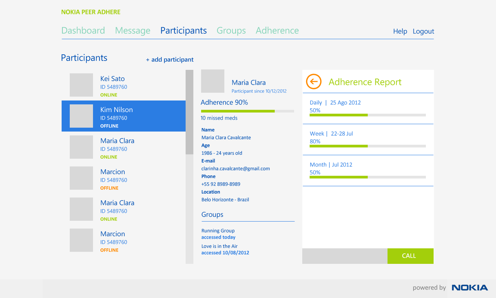
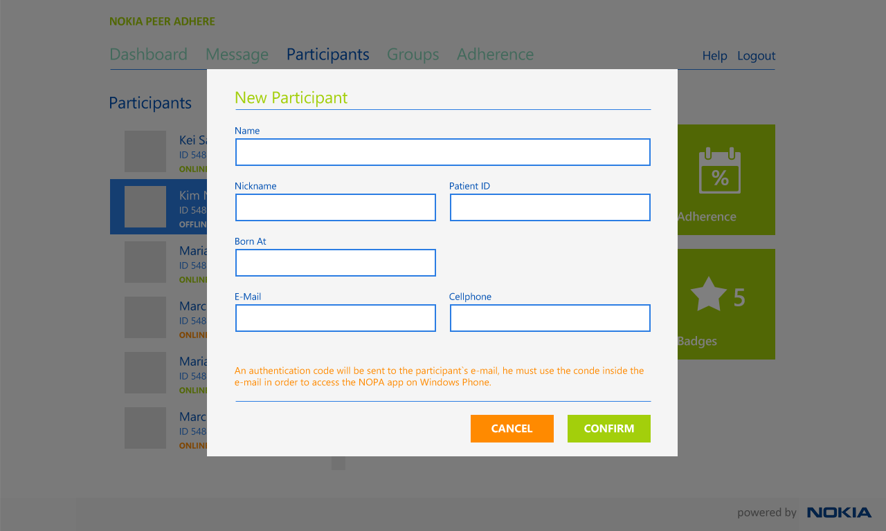
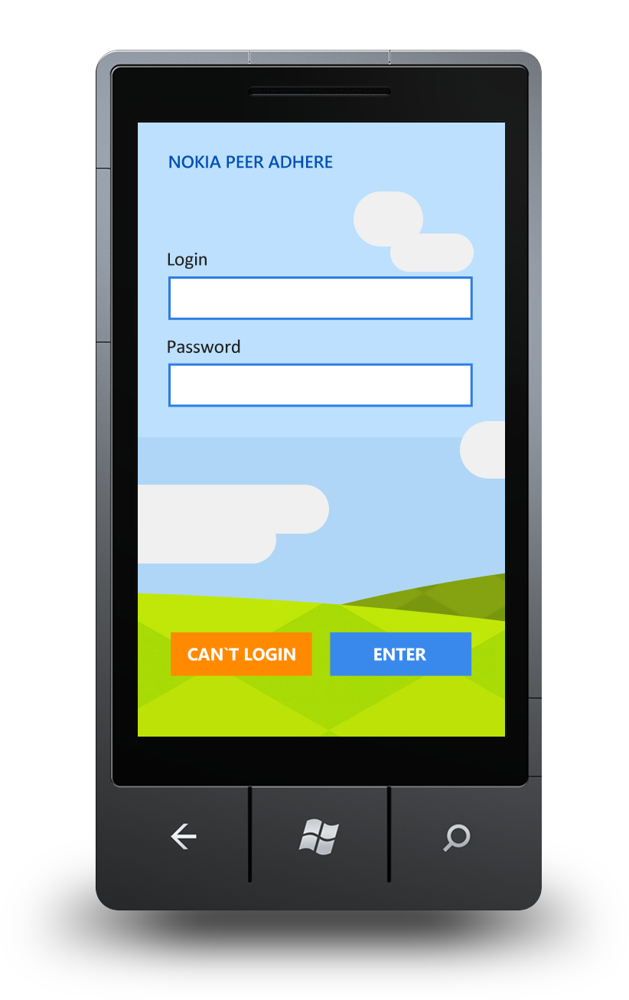

.. _adding-a-patient:

****************
Adding a patient
****************

Patients are added by selecting the **add participant** link after selecting the **Participants** tab.

   The Participants tab

This will present a form asking some details about the new patient.

   New Participant Form

Clicking **CONFIRM** will send an email to the patient which contains their login and password. These details then need to be entered by the patient when logging in on the mobile client

   Client Login