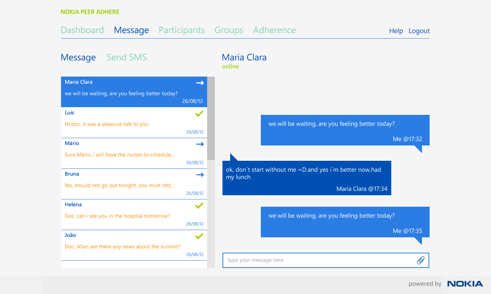
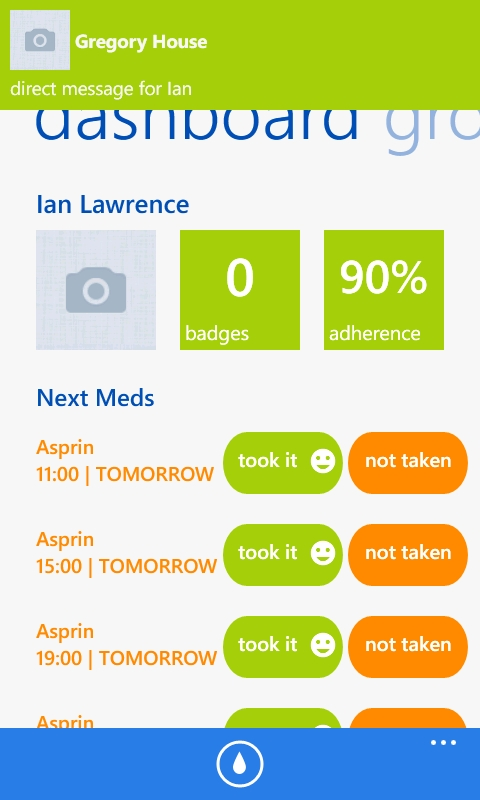

.. _direct-messages:

***********************
Sending Direct Messages
***********************

Select the **Message** tab and the user who will receive the message

   Send Direct Message

Send a message to the group by clicking on the group, type in the text and enter. Images can also be sent to the group by clicking on the paper clip icon. 

The message will be pushed and the client will receive a notification

   Direct Message Notification

